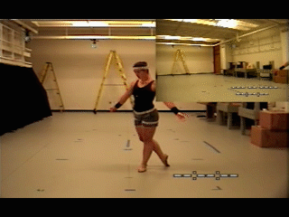

Dancer Skin Decomposition
========

A Demo that convert an offline-simulated cloth to real-time skeletal animation using Smooth Skinning Decomposition with Rigid Bones

1. Dancer animation from [CMU Mocap Lab](https://sites.google.com/a/cgspeed.com/cgspeed/motion-capture/cmu-bvh-conversion)  
This Demo use 05-05 clip  
  
`animation/05_05.bvh`  

2. Animation retargeted in Motionbulder  
`animation/dancer_retarget.fbx`  

3. Cloth simulated with Houdini Vellum  

`animation/dancer.hipnc`  

4. Skeleton baked with [SSDR4maya](https://github.com/maajor/ssdr4maya)  

5. Rendered with UE4  

For more detail, please see my blog [Skin Decomposition | 蒙皮分解](http://ma-yidong.com/2019/02/14/skin-decomposition/)